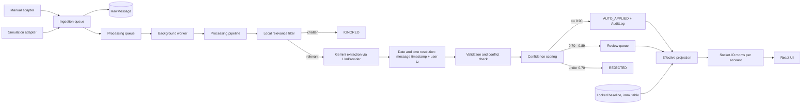

# ClassSync

**AI-powered college schedule assistant.** ClassSync ingests the messages that already flow through a
college WhatsApp group, decides which ones actually change your timetable, applies the confident ones and
asks you about the rest — all in real time.

> A cancelled lecture posted at 9:02 AM shows up struck through on your dashboard before your coffee cools.

## Table of contents

- [What it does](#what-it-does) · [Architecture](#architecture)
- [Baseline vs Effective](#baseline-vs-effective-the-core-idea)
- [The processing pipeline](#the-processing-pipeline) · [Tech stack](#tech-stack)
- [Getting started](#getting-started) · [Environment variables](#environment-variables)
- [Demo simulator](#using-the-demo-simulator) · [Testing](#testing) · [Security](#security)

---

## What it does

| Capability | Details |
| --- | --- |
| **Timetable import** | CSV, JSON and **timetable photos** (Gemini vision) → one validated row schema |
| **Immutable baseline** | Your confirmed timetable can never be overwritten — enforced in the model layer |
| **Message ingestion** | Manual input plus a 30-message simulated WhatsApp scenario, behind a pluggable adapter contract |
| **AI pipeline** | Relevance gate → Gemini extraction → date resolution → conflict detection → confidence routing |
| **Human in the loop** | Anything uncertain (0.70–0.89) is queued for review with the raw message side by side |
| **Realtime UI** | Socket.IO pushes cancellations, shifts and review items to every view, no refresh |
| **Full audit trail** | Every mutation is append-only; any applied change can be reverted |
| **Deduplication** | Identical messages are hashed per account and never processed twice |

## Architecture



## Baseline vs Effective (the core idea)

- **Baseline** — `TimetableEntry` documents are your *original, confirmed* timetable. Once a version is
  locked it is **immutable**: saves, updates and deletes are refused by the schema itself
  (`BaselineImmutableError`), not by application-level checks. The only way forward is a new
  `baselineVersion`.
- **Effective** — what you actually experience on a given day, always derived as
  `baseline + applied ScheduleChanges`. It is never stored.
- **Reverting** a change simply stops applying it, so the baseline is never rewritten and the audit log
  keeps both the application and the revert.

A cancelled class therefore can never corrupt your timetable: the pipeline only ever writes
`ScheduleChange` documents *next to* the baseline.

## The processing pipeline

| Stage | What happens | On failure |
| --- | --- | --- |
| Normalization | event validated against the shared `MessageEvent` contract | rejected at the boundary |
| Relevance | course/alias plus change-intent regex (English **and** Hinglish) | `IGNORED` — **no LLM call** |
| Extraction | Gemini returns strict JSON, one repair pass if it deviates | `FAILED` + `processingErrors` |
| Resolution | `today`, `kal`, `tomorrow`, weekdays, `2 PM`, `11 instead of 9` resolved against the **message timestamp** in the user's timezone | missing values stay `null` |
| Validation | subject must match a baseline course (code, name, alias or typo-tolerant fuzzy match) and resolve to exactly one class | rejected with a reason |
| Conflicts | proposed window compared with the rest of that weekday | forced to review, never auto-applied |
| Scoring | deterministic and explainable; factors stored on the change | — |
| Routing | `>= 0.90` apply · `0.70–0.89` review · `< 0.70` reject | audit entry for applied changes |

### Confidence policy

| Score | Meaning | Result |
| --- | --- | --- |
| `>= 0.90` | certain, unambiguous, no conflict | applied automatically, audit entry written |
| `0.70 – 0.89` | plausible but hedged, conflicting or incomplete | queued for your review |
| `< 0.70` | unknown subject or low certainty | stored as `REJECTED` for the audit trail |

Penalties: ambiguity 0.25 · conflict 0.20 · missing date 0.15 · missing required field 0.20 · a course
identity needing 2+ character edits 0.15.

## Tech stack

| Layer | Technology |
| --- | --- |
| Frontend | React 19, TypeScript 6, Vite 8, TailwindCSS v4, React Router 7, socket.io-client |
| Backend | Node 24, Express 5, TypeScript, Socket.IO 4, Mongoose 9 |
| Data | MongoDB (in-memory server in tests), Luxon for IANA timezones |
| AI | `@google/genai` (e.g. `gemini-1.5-flash`) behind an internal `LlmProvider`, Zod contracts |
| Auth | `jose` (HS256 JWT), scrypt password hashing (Node built-in) |
| Observability | pino with field redaction, express-rate-limit |
| Quality | ESLint 10, Prettier, Vitest 5, tsup |

## Repository layout

```
classschedule/
├── apps/
│   ├── web/          React client: login, dashboard, timetable, review, simulator, audit
│   └── server/       Express API, Socket.IO, pipeline, workers, seed script
└── packages/
    └── shared/       Zod contracts, enums, MessageEvent + MessageSourceAdapter, socket events
```

## Getting started

**Prerequisites:** Node.js >= 20.19 (developed on 24) and a MongoDB instance.

```bash
# 1. install
npm install

# 2. configure (defaults are fine for local development)
copy apps\server\.env.example apps\server\.env      # Windows
# cp apps/server/.env.example apps/server/.env      # macOS / Linux

# 3. recommended: demo account + locked baseline timetable
npm run seed -w @classsync/server
#   -> demo@classsync.app / demo1234

# 4. run API (:4000) and web (:5173) together
npm run dev
```

Open <http://localhost:5173>, sign in with the seeded account, open **Messages** and press
*Send next simulated message* — the dashboard and timetable update live.

### Root scripts

| Script | Purpose |
| --- | --- |
| `npm run dev` | API + web with hot reload |
| `npm run build` | Production bundles (tsup for the server, Vite for the web) |
| `npm test` | Vitest across every workspace |
| `npm run typecheck` | Strict TypeScript check (no `any`, `noUncheckedIndexedAccess`) |
| `npm run lint` / `npm run format` | ESLint / Prettier |
| `npm run seed -w @classsync/server` | Reset and re-create the demo account and baseline |

## Environment variables

Every value is parsed and validated with Zod at boot; the server refuses to start on invalid config.
See `apps/server/.env.example`.

| Variable | Default | Purpose |
| --- | --- | --- |
| `PORT` | `4000` | API port |
| `WEB_ORIGIN` | `http://localhost:5173` | allowed CORS origin |
| `MONGODB_URI` | `mongodb://127.0.0.1:27017/classsync` | database connection |
| `JWT_SECRET` | `dev-secret-change-me` | JWT signing key — **must** be changed in production |
| `JWT_EXPIRES_IN` | `7d` | access token lifetime |
| `TZ_DEFAULT` | `Asia/Kolkata` | default user timezone for date resolution |
| `LLM_PROVIDER` | `stub` | `stub`, `gemini`, `openai` or `anthropic` |
| `LLM_API_KEY` | – | key for the selected provider (required for `gemini`) |
| `LLM_MODEL` | `gemini-3.8-flash` for Gemini | model id (must be one your key can access) |
| `LOG_LEVEL` | `info` | pino level (`silent` disables logging) |
| `RATE_LIMIT_WINDOW_MS` | `60000` | rate limit window |
| `AUTH_RATE_LIMIT_MAX` | `10` | register/login requests per window per IP |
| `MESSAGE_RATE_LIMIT_MAX` | `60` | ingestion requests per window per IP |
| `WORKER_ENABLED` | `true` | background worker that runs the pipeline |
| `WORKER_INTERVAL_MS` | `4000` | worker poll interval |

## Using the demo simulator

The simulator replays a scripted **30-message** conversation containing cancellations, room changes,
time shifts, online classes, typos (`DBS` for DBMS), Hinglish, ambiguity
(`I think DBMS is cancelled`), a self-contradicting follow-up and pure chatter.

1. **Seed or import a baseline** and lock it (`npm run seed`, or import CSV/JSON/a photo and press
   *Lock*). Without a locked baseline the pipeline has nothing to validate against and rejects messages.
2. Open **Messages** → *Demo simulator*.
3. Press **Send next simulated message** (or *Replay all* / *Reset scenario*).
4. Watch it happen:
   - `DBMS class cancelled today` → **auto-applied**; the class is struck through everywhere, instantly.
   - `DBMS lecture shifted to 2 PM today` → applied as `11:00 → 14:00` with an indigo marker.
   - `I think DBMS is cancelled` → **queued for review**; the nav badge counts up.
   - `Does anyone have the DSA notes?` → `IGNORED`, no LLM call, nothing on your timetable.
   - `DBS cancel ho raha hai` → resolved to the real course by fuzzy matching.
5. Open **Review** to edit the proposed time/room and approve or reject; open **Changes** for the
   append-only audit log.
6. Type your own message and press **Send & process** to run the pipeline on demand.

The same flow over HTTP:

```bash
curl -X POST http://localhost:4000/api/messages/simulate \
  -H "Authorization: Bearer $TOKEN" -H "Content-Type: application/json" \
  -d '{"mode":"next"}'
```

Duplicates are ignored: replaying the same scripted message returns the existing record instead of
processing it twice.

## Testing

```bash
npm test                       # everything
npm test -w apps/server        # API, pipeline, workers, realtime
npm test -w apps/web           # React shell
```

Coverage is real integration, not mocks where it matters: HTTP routes through supertest, MongoDB
through an in-memory server, and a genuine websocket round-trip asserting an authenticated client
receives `schedule.cancelled` when a change auto-applies.

## Security

- Passwords are hashed with **scrypt** (Node built-in, per-password salt, constant-time comparison).
- All private REST routes **and** socket handshakes require a valid JWT; each account gets its own room.
- **Rate limiting** protects auth endpoints (default 10/min) and ingestion (default 60/min).
- **Structured logging** redacts `password`, `passwordHash`, `token`, `authorization`, `rawText`,
  `imageBase64` and `metadata` at write time — credentials and message bodies never reach the log.
- Timetable photos arrive as base64 (25 MB route limit) behind a Zod contract.
- The baseline is immutable at the database layer: no request path can rewrite confirmed history.

## Troubleshooting

| Symptom | Fix |
| --- | --- |
| `npm` blocked by PowerShell policy | use `npm.cmd`, or set an execution policy |
| `db: "disconnected"` in `/api/health` | start MongoDB or point `MONGODB_URI` at an instance |
| `429 Too many requests` | expected — wait out the window or raise the limits |
| `503` from image import | set `LLM_PROVIDER=gemini` **and** `LLM_API_KEY` |
| Messages stay `FAILED` | the LLM call failed — the exact API error is in `processingErrors` and the server log |
| Socket stays "Reconnecting" | confirm the API is on :4000 and the `/socket.io` dev proxy is active |

## Status

Phases 1–7 are complete: tooling, database layer with immutability guards, auth, timetable import,
adapters and ingestion, the AI pipeline, the realtime web UI, and hardening. The optional Android
notification scraper is the only intentionally deferred component — it plugs in as another
`MessageSourceAdapter`.